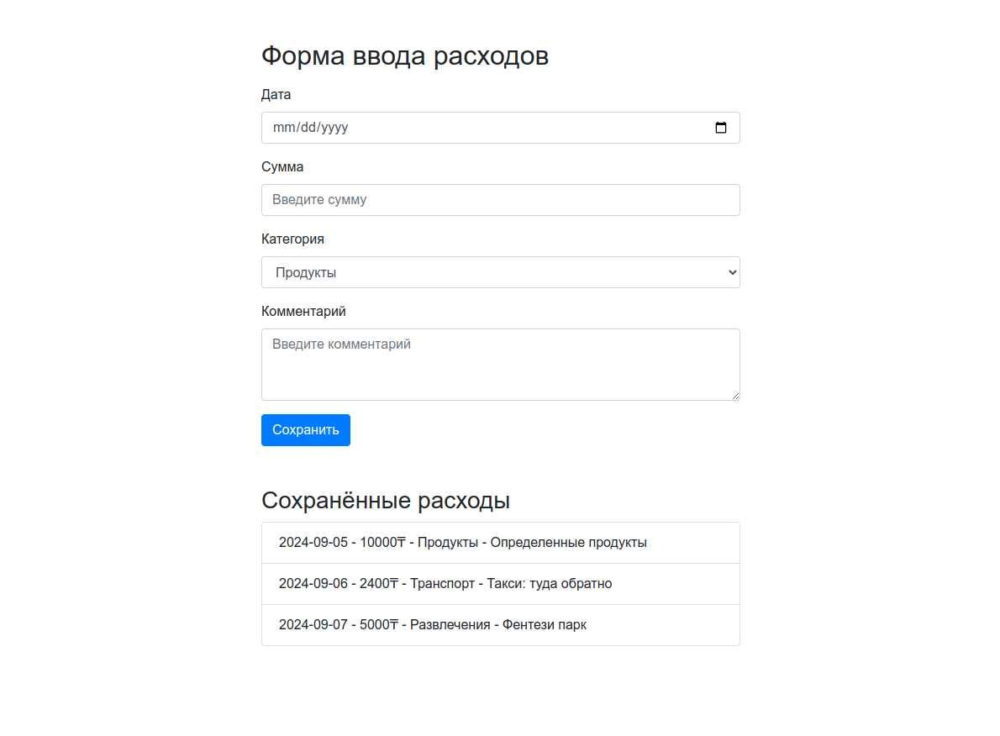

# Expense Form Task

Это простая форма для ввода расходов, которая сохраняет данные в Local Storage. Форма содержит следующие поля:

- Дата (календарь)
- Сумма
- Категория (выбор из списка)
- Комментарий

## Скриншот

